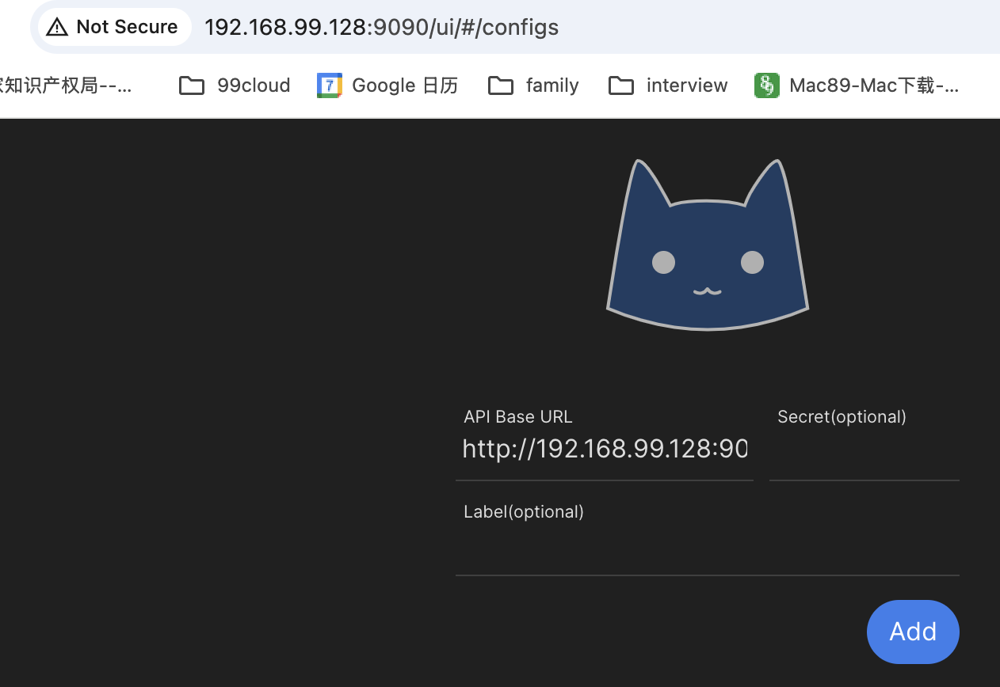
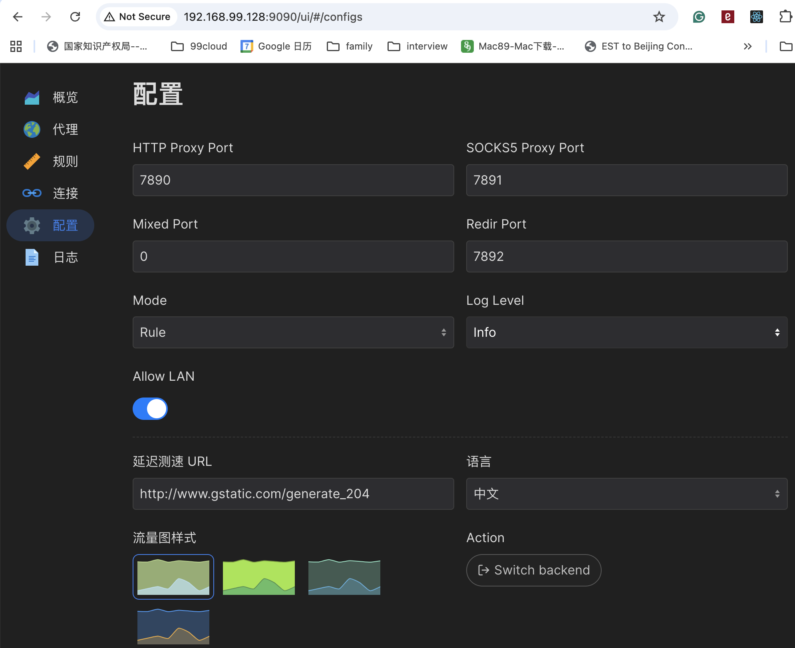

# To run
copy this repo to linux os:

```
mkdir ~/.config
cd ~/.config
git clone https://github.com/gongysh2004/clash.git
```

copy your config file:
```
cp your_config_file clash/config.yaml
```
config the dashboard:
```
allow-lan: true
mode: rule
log-level: info
external-ui: dashboard
external-controller: '0.0.0.0:9090'
```

start the clash:
```
tmux new-session -d -s "clash" ~/.config/clash/clash.linux -f ~/.config/clash/config.yaml
```
after that, you can attach the session:
```
tmux a -t clash
```

# To access the dashboard
http://{your-ip}:9090/ui/

first, add http://{your-ip}:9090 backend:


then we can see the config:

